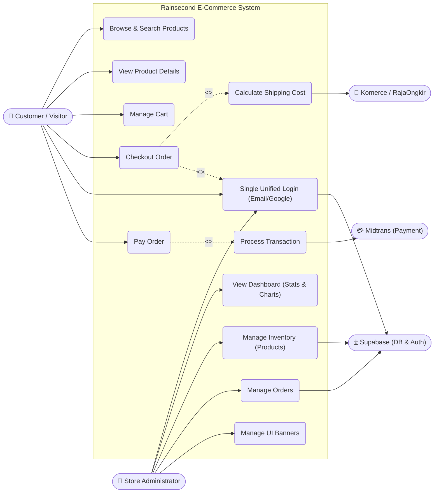
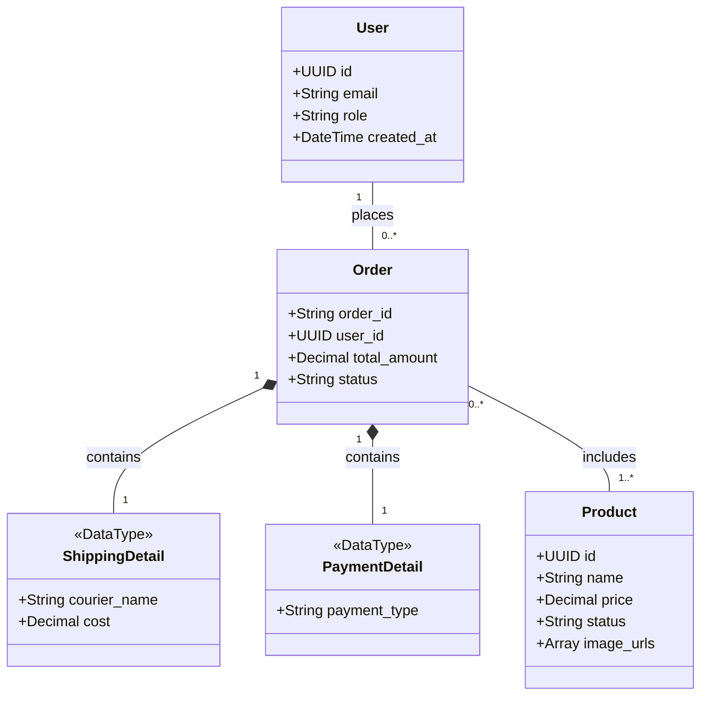
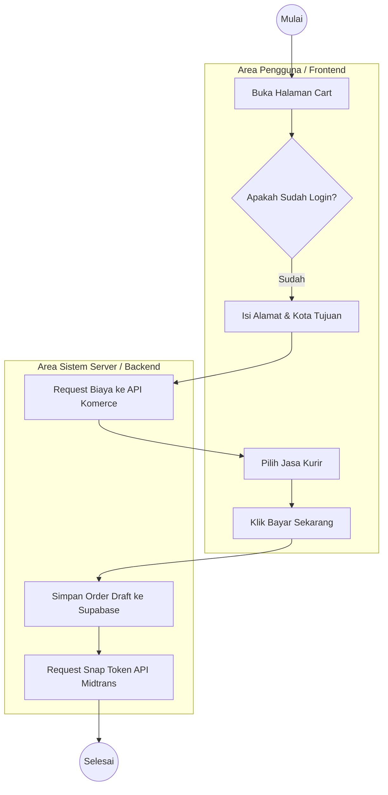

# Dokumentasi Proyek E-Commerce Thrifting Store

## 1. Use Case Diagram

---

## 2. Class Diagram

---

## 3. Activity Diagram (Alur Checkout)

---

## 4. Tabel Pengujian Blackbox

| Skenario | Hasil yang Diharapkan |
|---|---|
| Login Admin yang benar | Masuk ke halaman Dashboard Admin `/admin` |
| Buka Checkout tanpa Login | Dialihkan (Redirect) ke halaman Login |
| Pilih kota tujuan di Cart | API Komerce merespon dengan daftar harga kurir |
| Pembayaran Gagal di Midtrans | Status Order menjadi "cancel", Barang kembali "available" |
